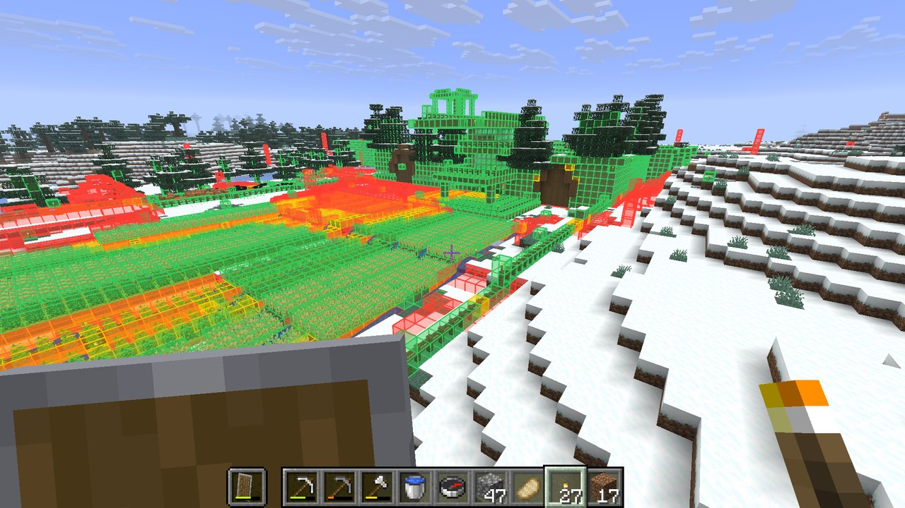
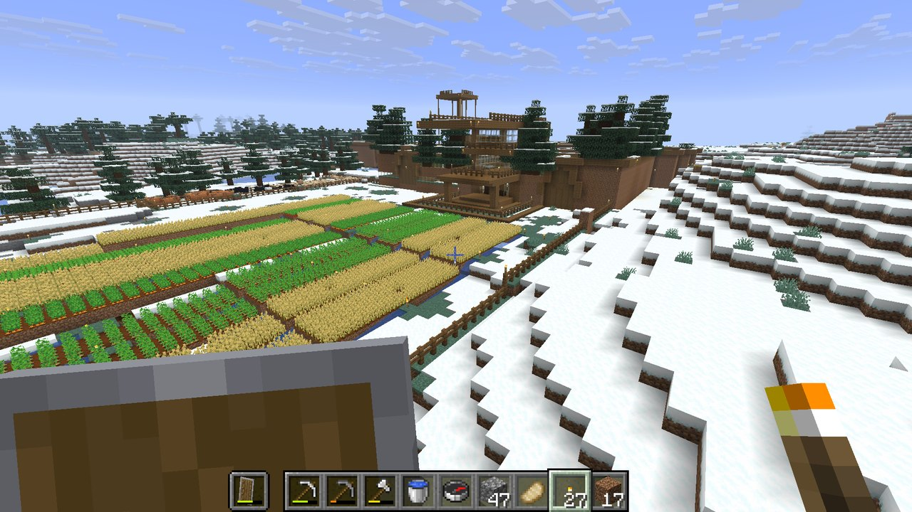
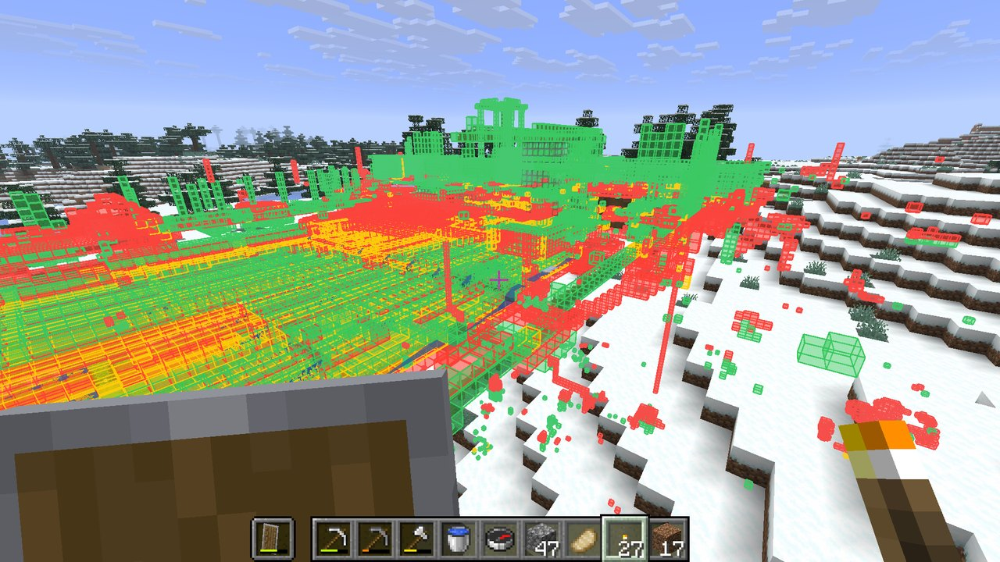
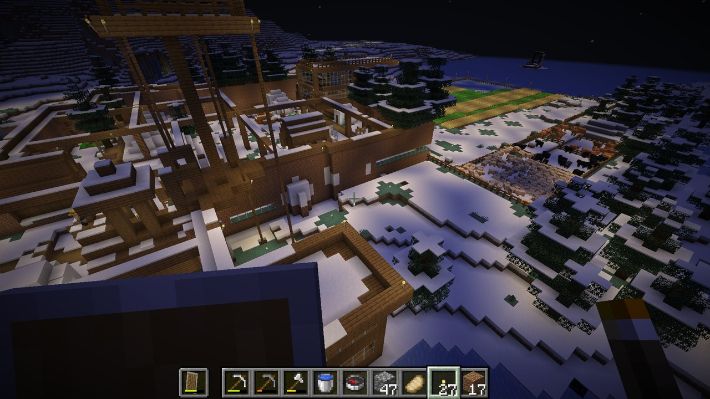
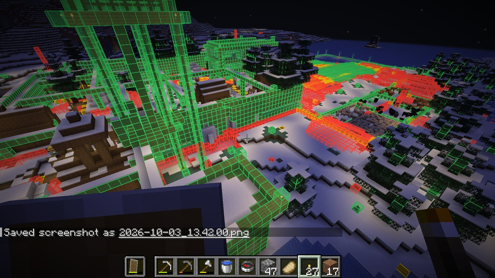
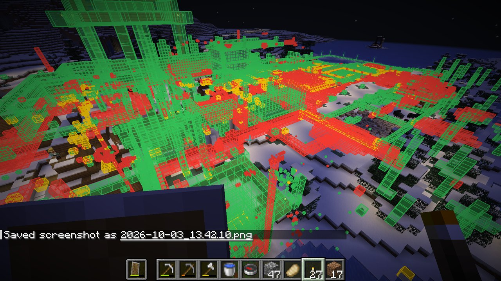

# mc-diff

A client-side Fabric mod for Minecraft 26.2 that shows what you've changed in your world.



- **Red**: a block that was there originally and is now gone (dug out, cut down, blown up)
- **Green**: a block where there was nothing originally (things you built)
- **Yellow**: a block that was replaced by a different one

Some things are left out because they change on their own: liquids, fire, ice, snow layers, leaves, grass tufts,
flowers, mushrooms, vines and other creeping plants. Block states are ignored too, so opening a door or a crop growing
doesn't count. A cut-down tree still shows up through its trunk.

## Screenshots

| | Normal | mc-diff on | X-ray on |
| --- | --- | --- | --- |
| Day |  |  |  |
| Night |  |  |  |

X-ray shows changes through terrain, which is where all the old mining tunnels and cave bridges turn up.

## Installing

1. Install [Fabric Loader](https://fabricmc.net/use/) 0.19.5 or newer for Minecraft 26.2.
2. Put [Fabric API](https://modrinth.com/mod/fabric-api) and the mc-diff jar in your `mods` folder.

That's it. It only needs to be on your client, including when you play on servers.

## How it works

The first time your client sees a chunk, the mod saves a compact snapshot of its blocks. Brand-new chunks are
seen right after generation, so in a new world the baseline is untouched terrain. After that, every chunk is
compared against its snapshot.

In an existing world, the baseline for each chunk is whatever it looked like the first time you loaded it with the
mod installed.

Snapshots are stored in `<save>/mcdiff/` for singleplayer worlds and in `.minecraft/mcdiff/<server>/` for servers.
Nothing is needed on the server.

## Commands

| Command | What it does |
| --- | --- |
| `/mcdiff` | Show or hide the diff |
| `/mcdiff xray` | See changes through terrain |
| `/mcdiff range <chunks>` | How far away changes are drawn (default 8 chunks) |
| `/mcdiff stats` | Totals for the dimension and the most removed/placed blocks |
| `/mcdiff original` | Rebuild the baseline from the world's seed (singleplayer only) |
| `/mcdiff original stop` | Pause a rebuild; running the command again continues it |

## Diffing against the original terrain

By default the baseline is whatever a chunk looked like the first time the mod saw it, so in a world that existed
before the mod was installed, older changes don't show. `/mcdiff original` fixes that for the dimension you're in: it
regenerates every saved chunk from the world's seed in a temporary hidden dimension and uses that untouched terrain as
the baseline. Your real chunks are read from the save files and never modified. It takes a while on big worlds, you
can keep playing meanwhile, and progress shows above the hotbar.

Where generated features from neighbouring chunks overlap (trees crowding each other, lakes, ore blobs, a geode
cutting into a structure), which one wins depends on the order chunks were first generated in, and that order isn't
saved anywhere. So the terrain is generated twice, in opposite orders, and any spot where the two disagree is marked as
unknown and left out of the diff. That catches a lot of it, though not all, since the real world may have been
generated in yet another order.

Natural terrain (stone, its variants and ores, dirt, grass, sand, gravel, clay, sculk and the like) also counts as one
block, so ore and dirt patches that landed slightly differently don't show. Digging any of it out still does. Stone,
cobblestone or obsidian where there used to be water or lava counts as the liquid hardening, not as something you
placed.

This only works properly if the world was generated on the Minecraft version you're playing now. Some noise is left,
almost all of it underground: edges of lakes and sulfur pools, lava that flowed into water and turned into
cobblestone, and the odd tree trunk in dense forests. On the surface around your builds it's rare.

## Building

Requires Java 25.

```
./gradlew build
```

The jar lands in `build/libs/`. `./gradlew installToPrism` builds it and copies it into a Prism Launcher instance named
`mc-diff`, replacing the previous build.

`./gradlew runClientGameTest` starts the game and runs three tests:

- a flat world where blocks are dug, built and replaced, checking the overlay, x-ray, stats and that the baseline
  survives a reload
- a normal world where changes are made, mc-diff's data is deleted, and `/mcdiff original` has to find the changes again
- an untouched world rebuilt from its seed, where anything reported is noise

Screenshots from the tests land in `build/run/clientGameTest/screenshots/`.
